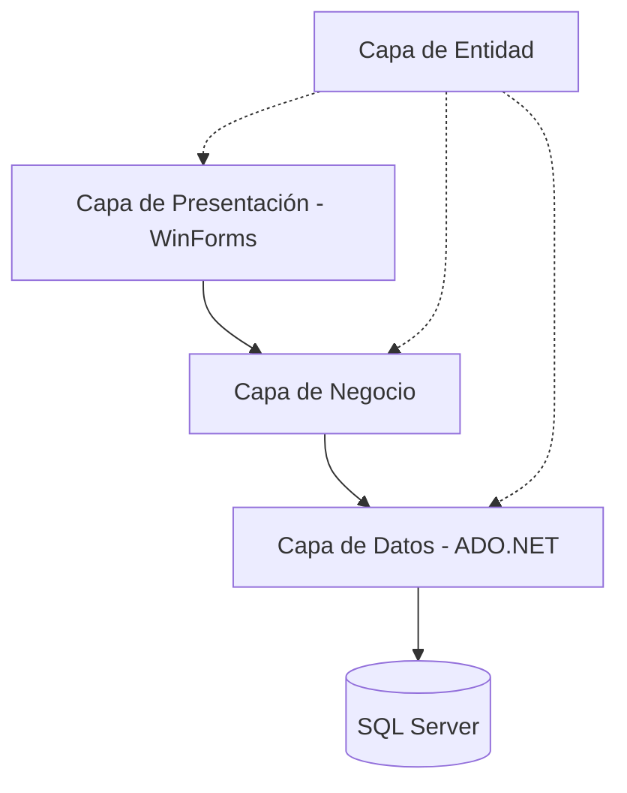

# 🛒 Sistema de Ordenes de trabajo


## 📋 Descripción General
Este es un robusto **Sistema de Ordenes de trabajo** desarrollado bajo una arquitectura empresarial de N-Capas utilizando C# y WinForms. El sistema resuelve la necesidad de centralizar el control de inventarios, compras, ventas y reportes en entornos de pequeñas y medianas empresas, ofreciendo una interfaz intuitiva con funcionalidades avanzadas como exportación a Excel e impresión de recibos en PDF.

---

## 🏗️ Arquitectura del Sistema

El proyecto implementa una arquitectura **N-Layer** para garantizar la escalabilidad y mantenibilidad del código.

### Flujo de Datos


1.  **CapaPresentación:** Interfaces de usuario (Desktop), validaciones visuales y manejo de eventos.
2.  **CapaNegocio:** Reglas de negocio y lógica de procesamiento.
3.  **CapaDatos:** Consultas SQL y ejecución de Procedimientos Almacenados mediante `SqlConnection`.
4.  **CapaEntidad:** Definición de objetos POCO (Plain Old CLR Objects) que fluyen entre capas.

---

## 🛠️ Stack Tecnológico

| Tecnología | Propósito |
| :--- | :--- |
| **C# 10.0** | Lenguaje de programación principal. |
| **.NET Framework 4.7.2** | Runtime del sistema. |
| **SQL Server** | Motor de base de datos relacional. |
| **FontAwesome.Sharp** | Iconografía moderna en WinForms. |
| **iTextSharp** | Generación y personalización de recibos en PDF. |
| **ClosedXML** | Automatización de exportes a Microsoft Excel. |
| **ADO.NET** | Acceso a datos de alto rendimiento. |

---

## 🧩 Patrones de Arquitectura Clave

*   **Repository Pattern (Simulado):** Las clases `CD_` encapsulan por completo la interacción con la base de datos, separando el "qué" del "cómo".
*   **Transactions:** Lógica crítica (como registrar una venta y descontar stock) se maneja mediante transacciones integradas en Procedimientos Almacenados para asegurar la consistencia.
*   **Separation of Concerns (SoC):** Cada capa tiene una responsabilidad única y aislada, facilitando el testing y la depuración.

---

## 📂 Estructura del Proyecto

```text
SistemaVentasOtro/
├── CapaDatos/          # Conexión y ejecución de Stored Procedures
├── CapaEntidad/        # Clases de dominio (Producto, Venta, etc.)
├── CapaNegocio/        # Lógica de validación y reglas de sistema
├── CapaPresentacion/   # Formularios WinForms y recursos UI
├── SistemaVentasApi/    # API de soporte (Servicios Web)
├── QueryResumen.sql    # Script principal de Base de Datos
└── SistemaVentas.sln   # Solución de Visual Studio
```

---

## 🚀 Instalación y Configuración

Siga estos pasos para desplegar el entorno de desarrollo en menos de 15 minutos:

### 1. Prerrequisitos
*   **Visual Studio 2022** con la carga de trabajo de "Desarrollo de escritorio de .NET".
*   **SQL Server Express** (2014 o superior).

### 2. Configuración de Base de Datos
Utilice el archivo `QueryResumen.sql` incluido en la raíz:
1.  Abra *SQL Server Management Studio (SSMS)*.
2.  Cree una base de datos llamada `DBVENTASDEMO`.
3.  Ejecute todo el script `QueryResumen.sql`. Esto creará las tablas, relaciones, procedimientos almacenados y la data inicial.

### 3. Configuración de Conexión
Edite el archivo `CapaPresentacion/App.config`:
```xml
<connectionStrings>
    <add name="cadena_conexion" 
         connectionString="Data Source=TU_SERVIDOR;Initial Catalog=DBVENTASDEMO;Integrated Security=True;" 
         providerName="System.Data.SqlClient" />
</connectionStrings>
```

### 4. Credenciales de Acceso (Default)
El sistema incluye un usuario administrador listo para usar:
*   **Documento:** `101010`
*   **Clave:** `123`

---

## 📖 Uso
*   **Ventas:** Selección de productos mediante escaneo o búsqueda manual, cálculo automático de cambio y generación de recibo.
*   **Compras:** Registro de entrada de mercadería con actualización automática de stock y precios.
*   **Reportes:** Visualización de dashboards y exportación masiva a Excel filtrada por fechas.

---

## 🛡️ Licencia
Este proyecto está bajo la Licencia MIT. Consulte el archivo `LICENSE` para más detalles.

---
> [!TIP]
> **¿Dificultades?** Asegúrese de que el servidor SQL permita conexiones integradas y de que el .NET Framework 4.7.2 esté instalado en su sistema.
